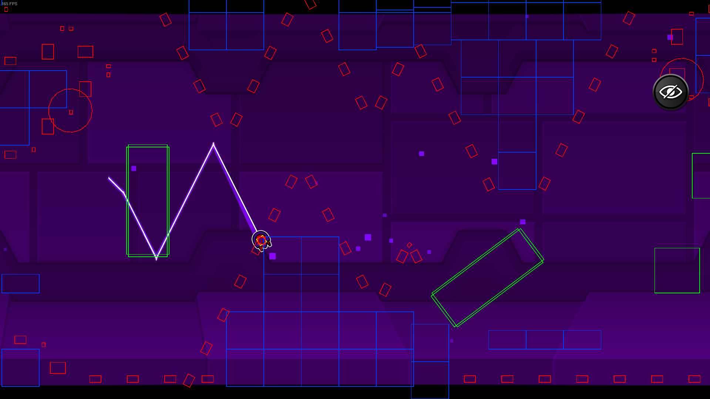
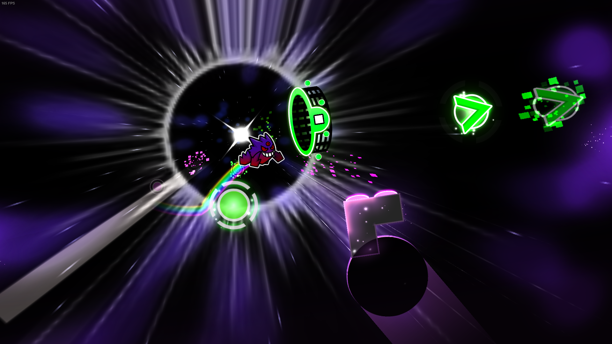

# Hide Pause Menu Mod for Geometry Dash

Adds a customizable hide button to Geometry Dash pause menu, perfect to get a better look at your deaths or capturing clean screenshots.

## Features
- Toggle visibility of all pause menu elements
- Configurable button position
- Two different modes

## Possible future features
Hiding the menu could hide:s
- Progression bar/percentage
- Practice checkpoints
- "New Best"/Diamonds/Orbs

On death:
- Show hitboxes

## Modes

### 1. Default Mode

Button remains visible when menu is hidden

*"Show hitbox on death" currently not included within the mod*

### 2. Screenshot Mode

Button disappears completely when hiding menu

## Configuration
Customize through Geode's mod settings:
- Toggle mod on/off
- Select button position (Left/Right/Center)
- Choose between Default/Screenshot modes
